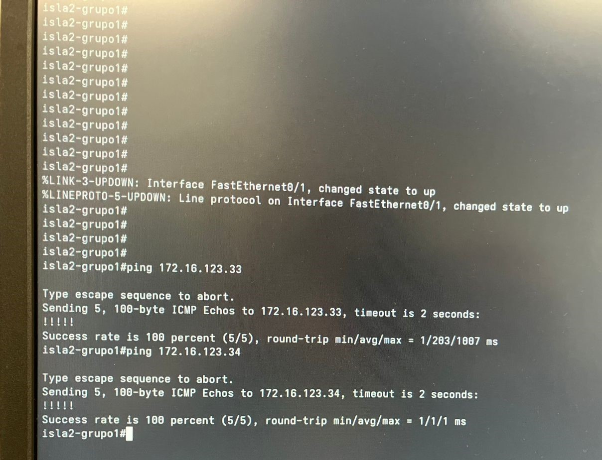
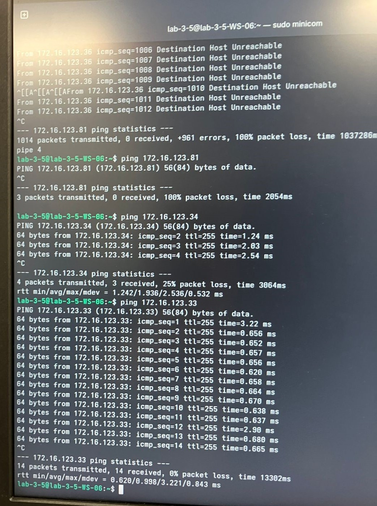
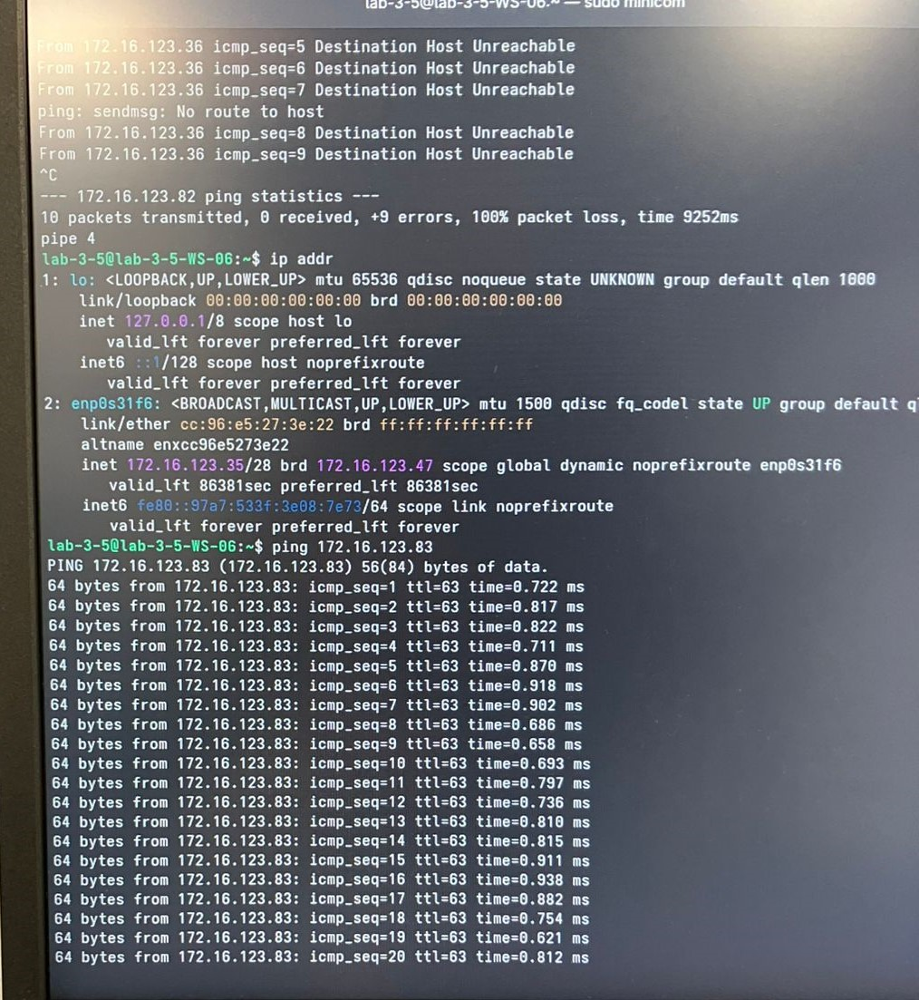

# Pruebas ping

En una computadora de la isla 2 con el switch L2 y su VLAN 120, eran las disponibles.

## Ping switch L2 de isla 2 a una computadora de la isla 2 y al switch L3

## Ping computadora de isla 2 al switch L2 y L3 de la isla 2 

## Ping computadora de isla 2 a una computadora de la isla 5

